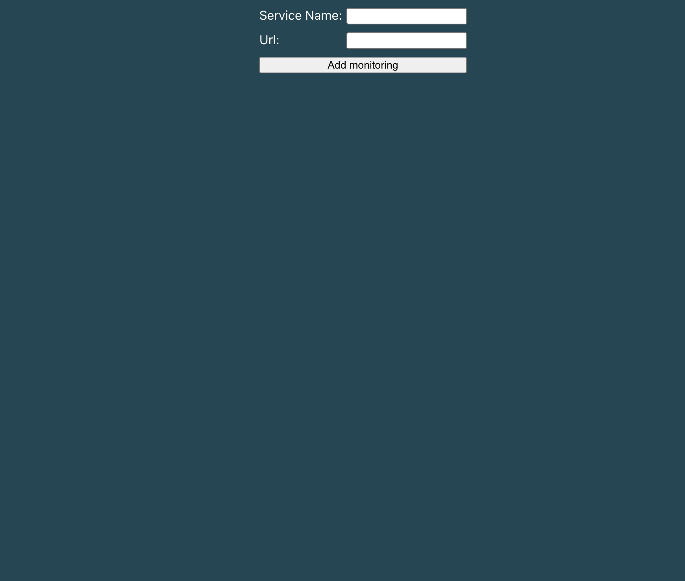
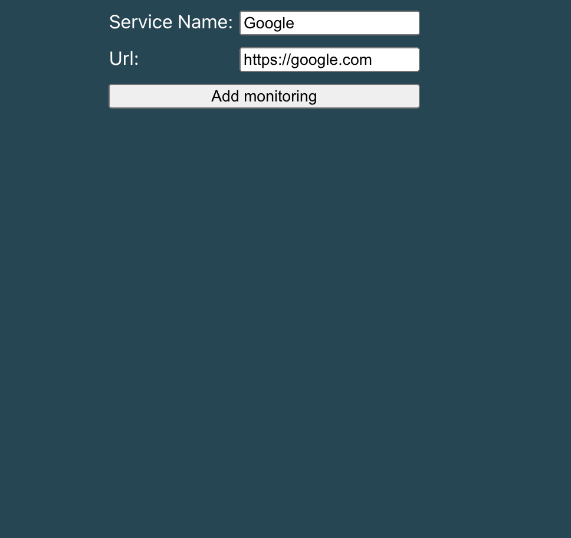
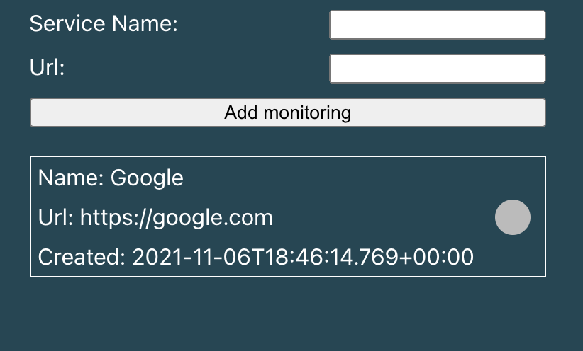
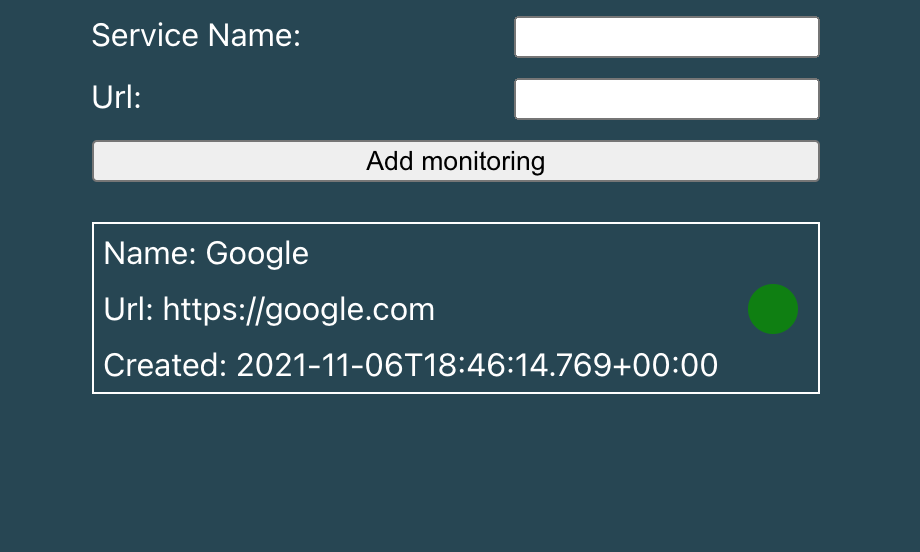

## Running the application

*Disclaimer*: This has only been tested in 2x MacOS enviornment only (with the intel chip).

### Fast route: With docker and docker compose

#### Installation

Make sure to have the following installed:

1. [Docker](https://docs.docker.com/get-docker/)
2. [Docker-Compose](https://docs.docker.com/compose/install/)


#### Running using docker-compose (assuming docker is running)

Stand in the root directory of the repo and run

```
docker-compose up
```

This will now create 3 different containers. 

1. PostgreSQL 14 which is used for storage. This container will save data to the `data` folder found in the root of the repo. The data directory ensures that even after a restart that the data is still persisted and available.
2. The Java 17 Spring boot backend service.
3. The frontend written in react.

You should now be able to reach the application in your browser by going to:

```
http://localhost:3000/
```

### For faster local development and running it without docker

#### Backend / Frontend

See respective folders for instructions.

### Running tests

See backend/frontend folder for readme instructions.

### Expected flow
The expected view for the landing page is the following



From here you can add a new Service for monitoring by specifying an URL and a name. 

See example of https://google.com



After pressing submit you should now see the service being in a pending state



Assuming that google is up and responsing to the request it will eventually turn green



# Dictionary

## Service

A "service" within the project refers to something that will be polled continuously.

# Disclaimer
Java isn't the language I work in. I spend my time in python meaning this is a very much a quick put together due to the requirement of writing Java. Frontend is something I have not touched for 3-4 years either.